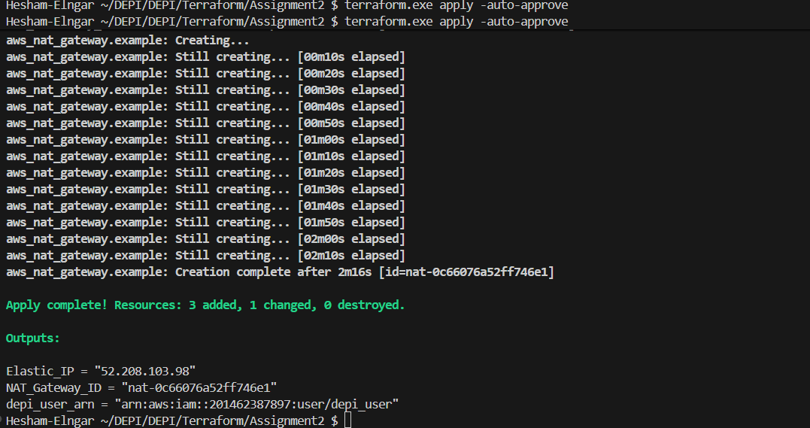

1- initialize terraform provider and install plugins and library
```bash
terraform init
```


2- create dry-run to ensure everything before apply
```bash
terraform plan
```


3- applying infra code on AWS
```bash
terraform init -auto-approve
```


---
4- Aws Console screenshots


---

5- Destroying infra
```bash
terraform apply -auto-approve -destroy
```


